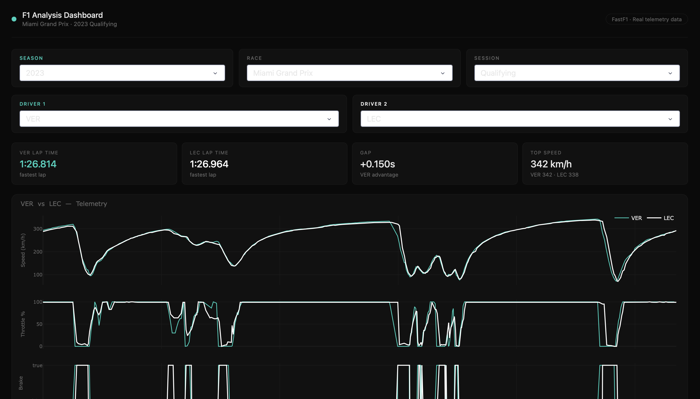

# F1 Race Analysis Dashboard

An interactive Formula 1 telemetry analysis dashboard built with Python, FastF1, and Dash.



## Features

- **Driver comparison** — overlay telemetry traces for any two drivers
- **Lap delta analysis** — see exactly where time is gained and lost meter by meter
- **Speed heatmap** — side by side track maps colored by speed
- **Full session selector** — any race, any season from 2018, qualifying/race/sprint

## Tech Stack

- [FastF1](https://github.com/theOehrly/Fast-F1) — F1 telemetry data
- [Dash](https://dash.plotly.com/) — interactive web dashboard
- [Plotly](https://plotly.com/) — data visualization
- Python, Pandas, NumPy, SciPy

## Setup

```bash
# Clone the repo
git clone https://github.com/shanumsharief/f1-analysis.git
cd f1-analysis

# Create virtual environment
python -m venv venv
source venv/bin/activate  # Windows: venv\Scripts\activate

# Install dependencies
pip install -r requirements.txt

# Run the dashboard
python dashboard.py
```

Then open http://127.0.0.1:8050 in your browser.

## Usage

1. Select a season, race, and session type
2. Pick two drivers to compare
3. Explore telemetry, lap delta, and track speed heatmaps

## Data

All data is sourced live from the FastF1 library which accesses the official F1 timing data. Sessions are cached locally after first load.
